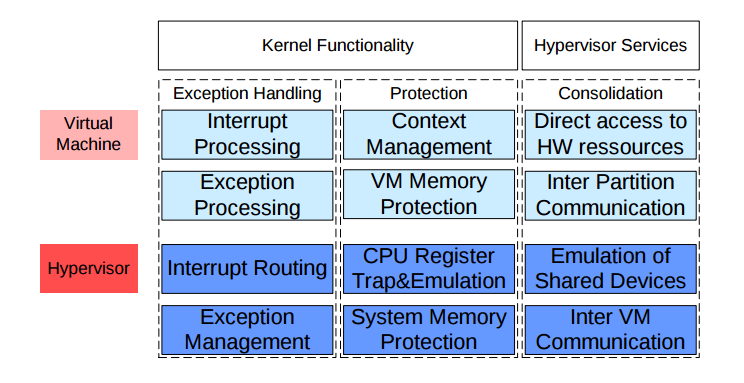
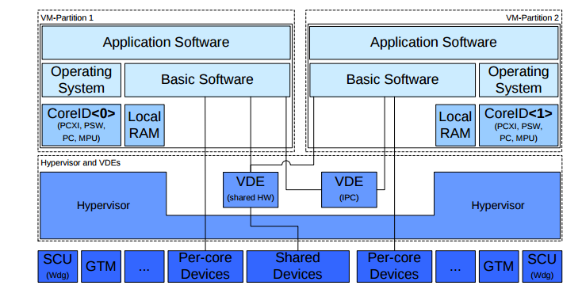

#### An Embedded Hypervisor for Safety-Relevant Automotive E/E-Systems(BMW)

- Based on ISO26262 standards to support virtual electronic control units within real time environment.
- Microkernel based approach on an MMU less platform.
- An ETAS baremetal hypervisor on AURIX TC27X platform.
- Interrupt processing, exception processing,VM memory protection left to Virtual machines.
- Interrupt routing, System memory protection, shared device support done in hypervisor, as shown below.

- Seperate timer interrupt per core for temporal seperation. Other interrupts can be rerouted.
- MMU protection region and registers assigned in terms of banks and supervisor modes. 
- Shown below is layered architecture.

- Basic Porting Overhead:
	- Change to startup code for hypervisor initialization.
    - AUTOSAR Microcontroller Abstraction Layer porting.
    - Paravirtualizing overheads to guest.
    - Virtual devices and associated overheads.
- Experiments:
	- Temporal overheads.
    - Memory overhead.