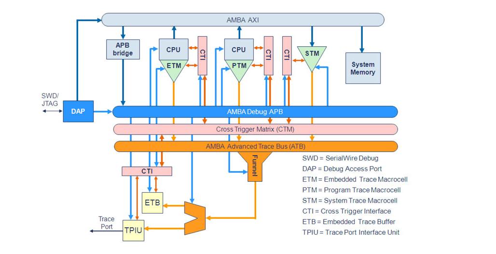

#### Note on the hardware assisted tracing support in Linux Kernel.

##### Program Trace- Intel
- Tracing, a technique used for both performance analysis and debugging.
- Linux ftrace can log function calls and trace point data for the kernel.
- Intel provides processor trace facility to log the branches and reconstruct the control flow of all executed codes.
- More information on Processor trace specification part of Intel Architecture Software Developers manual vol-3.
- ARM is migrating coresight tracing mechanism to Linux.
-Highly compressed data recording mechanism to avoid the bandwidth overhead. Non-Conditional branches are not logged, Conditional branches logged with one bit. Asynchronous events/Interrupts are also logged.
- The performance overhead is shifted from recording to decoding.
- Perf PT driver dumps the trace data to a circular buffer, which is later processed in user space.
- What is side band data and its importance to Perf tracing.
- Side band data is collected seperately and provides information relative to which thread and process are active. Side band data is synchronized with the aux data from PT driver using time stamps.
- PT decoder generates perf sample events which provides multiple options using the new --itrace mechanism.
- Enabling record in non root mode by using sysctl -w kernel.perf_event_paranoid =-1
- Snapshot can be stored after this in non-root mode.
- Run python or perl script to analyse the trace, do flamegraph representation etc.
- Debugging support as trace enables limited backtracing and recording of coredumps. Limited GDB support.

##### Coresight: Hardware assisted tracing support.

- CoreSight based approach provides integration with standard Perf Core. OpenCSD library for trace decoding.
- HW assisted tracing corner-stone: Ability to trace CPU without affecting performance.
- Each Core fitted with Embedded Trace macrocell(ETM), programmed by OS with specified trace characteristics.
- Traces generated by HW of format called program flow trace, which consists of set of waypoints(branch instruction, exception, returns, memory barriers. etc.)
- Coresight topology and impact?
- Effect of clock domain and power management(e.g. CPUIdle can take down ETM core as well.)

[Reference](http://events.linuxfoundation.org/sites/events/files/slides/ELC-E16.pdf)