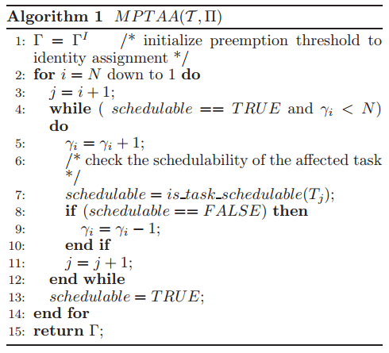
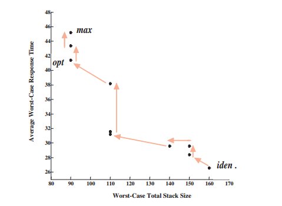

#### Preemption Threshold Scheduling: Stack Optimality, Enhancements and Analysis

Preemption thresholding scheduling (PTS) in a realtime multithreaded system reduces system preemptions and reduces run-time overhead while ensuring real-time constraints.  
Optimality of PTS is considered in this paper for minimizing systems total stack memory requirements.
- The paper focus on minimizing the stack usage due to preemption in embedded memory constrained systems.
- Main aim of the paper being, provided a workload give a limit on amount of memory that can be saved by limiting the preemptions while not violating any of of real-time constrains of given workload.
- Second aim is to provide a framework that applies to both fixed priority and dynamic priority schemes.
##### Overview
- Introduced as part of ThreadX.
- Many of the resource sharing protocols has been integrated along with PTS. priority cieling can be used along with extended approach to Baker's Stack Resource Policy runs along with PTS.
##### Details
- In case PTS blocking time on  a high priority task due to a low priority task, but with higher preemption threshold value needs to be considered.
- The worst case response time equation thus includes addition paramter blocking time, which is for all tasks with priority lower than current task but higher preemption threshold, maximum value of the budget.
##### Memory optimality and Response
- Stack memory optimality:
  - A contribution of this paper is to find a preemption level mapping that is both feasible and in some sense optimal.
  - Initially a identity preemption threshold assignment is done, identity preemption threshold assignment corresponds to value where PT is equal to tasks preemption level.
 ###### Baker's approach: Stack Resource Policy(SRP)
  - Aim to reduce priority inversions in dynamic scheduling tasksets. 
  - Preemption level(PL) as a concept is derived from Baker's proposal of [Stack Resource Policy](http://www.cs.fsu.edu/~baker/papers/mstacks3.pdf).
  - PL introduced by Baker represented as $\pi$  has a inverse relation the deadlines of given set of jobs. The level of jobs are assigned statically and a job J is not allowed to preempt another job $J^{'}$ d
  - Preventing multiple priority inversions:
     - To prevent deadlock a job should not be permitted to start until the resources currently available are sufficient to meet the maximum requirements of the job.
     - To prevent multiple priority inversions, a job should not be permitted to start until the resource currently available are sufficient to meet the maximum requirements of any single job that might preempt it.
 - Stack Resource Policy:
    - A task cannot preempt the system unless the PL of the task is greater than the current system PT.
    - On gaining system access, System PL is raised to that of the system.
 - Stack Saving:
    - One approach to saving stack is to partition tasks into groups that won't preempt each other and allocate single stack for each group.
     - ​Stack saving proposes a new approach, where tasks that can preempt each other as well to share a common stack.
     - The stack sharing assumes feather weight process abstraction, which is same as non extended task sets of OSEK. i.e, the task execution finishes are releases the resources.
     - provides support for stack blocking: For a shared stack a job J is stack blocked if another job $J^{'}$ is holding the space immediately above J and J cannot grow its stack instance without writing into $J^{'}$.
     - ​Usage of ceiling value of zero and prevention of stack locking.
 ###### Finding best fit Preemption Threshold(PT) Value
 Maximum Preemption Threshold Assignment, pseudo code :
 
- $\gamma​$ corresponds to individual preemption threshold.
- Algorithm has time complexity of $O(N^{2 } . q(N) )$.
- _is_task_schedulable()_ abstracts the scheduling approach used to either fixed or dynamic.
- Balancing parameter: System responsiveness due to value of PT vs Stack usage due to preemption.
- Responsiveness measured in terms of AWCRT or Average Worst Case Response Time. During traversal to maximum PT values with minimum stack usage there exists multiple vertical slopes with same stack usage but increasing AWCRT, balance usage on these slopes.
- 
- __Key Idea__ : Traverse backward from the maximum PT values and exit as soon as stack size starts to increase.

**Reference**: [Preemption Threshold Scheduling](https://www.researchgate.net/profile/Alexander_Dean3/publication/220267001_Preemption_Threshold_Scheduling_Stack_Optimality_Enhancements_and_Analysis/links/546530d40cf25b85d17d273f.pdf)

